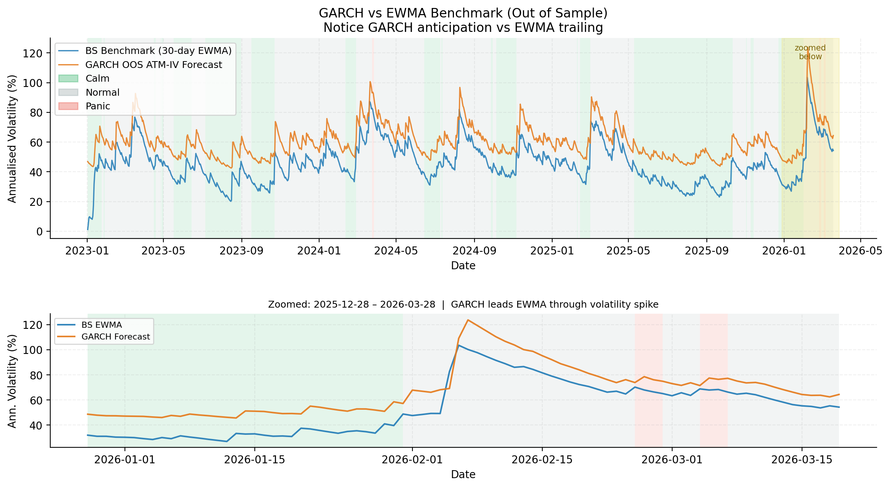
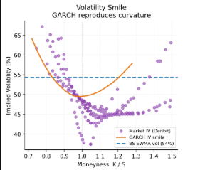
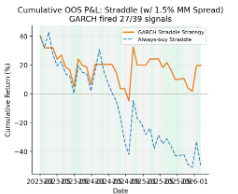
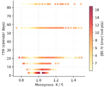
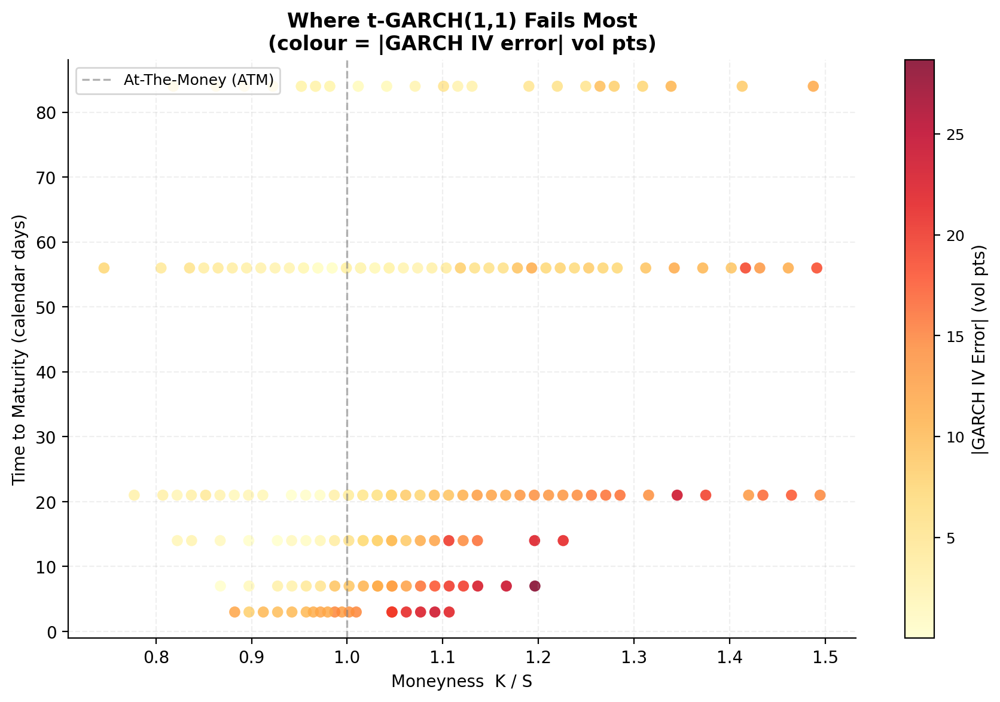

# To What Extent Does a Student-t GARCH(1, 1) Model Capture Observable Phenomena of Crypto Markets Better Than EWMA Black-Scholes Assumptions?

**Abstract**
The intersection of traditional financial engineering and decentralized digital assets presents unique challenges for derivative pricing. The foundational Black-Scholes-Merton (BSM) framework, predicated on the assumption of locally constant volatility and log-normal asset returns, often fails to capture the extreme volatility clustering and heavy-tailed distributions characteristic of cryptocurrency markets. This paper investigates the empirical out-of-sample efficacy of a Student-t Generalized Autoregressive Conditional Heteroskedasticity (t-GARCH(1,1)) model compared to a BSM model anchored by a 30-day Exponentially Weighted Moving Average (EWMA) volatility benchmark. Utilizing Bitcoin (BTC) spot data and live options chains, we classify market data into "Calm," "Normal," and "Panic" regimes based on native BTC historical volatility. Our out-of-sample findings (2023–2026) indicate that t-GARCH(1,1) significantly outperforms EWMA-BSM in capturing the volatility smile, anticipating volatility spikes, and accurately modeling 95% Value-at-Risk (VaR). Furthermore, an empirical straddle-trading backtest demonstrates that GARCH-derived volatility forecasts yield superior risk-adjusted returns even when accounting for a 1.5% market maker spread.

---

## 1. Introduction

### 1.1 The Evolution of Financial Markets
A financial market is fundamentally a mechanism for the allocation of capital and the transfer of risk. The advent of cryptocurrencies over the last decade has introduced a novel asset class that operates continuously and is subject to unique macroeconomic drivers, leading to market microstructures that differ vastly from traditional equities. Bitcoin (BTC), the premier digital asset, frequently exhibits severe violations of standard financial models, specifically regarding the distribution of its returns (Flovik, 2024).

### 1.2 The Mechanics of Options
Derivative pricing relies heavily on modeling the stochastic evolution of the underlying asset. Options—contracts granting the right but not the obligation to buy (Call) or sell (Put) at a specific strike price ($K$)—are highly sensitive to the market's expectation of future variance. As established by standard financial literature, American options contain an early exercise premium; non-dividend-paying American calls should rarely be exercised early, whereas American puts may be exercised early if the asset price crashes, creating a complex exercise boundary (Hull, 2015). Because non-dividend-paying crypto assets can experience massive intraday price dislocations, understanding the true cost of these derivatives requires models that respect the reality of "fat tails" (excess kurtosis) and volatility clustering.

### 1.3 The Research Gap
The model proposed by Black and Scholes (1973) assumes asset evolution follows a random walk with constant volatility. While modern practitioners often use a rolling historical metric—such as an Exponentially Weighted Moving Average (EWMA)—to update the BSM volatility parameter, this approach is fundamentally backward-looking. It trails market shocks rather than anticipating them. This paper quantifies how a dynamic, forward-looking variance model captures these phenomena out-of-sample compared to an EWMA-updated BSM baseline.

---

## 2. Related Works and Literature Review

The pricing of derivatives in highly volatile, non-traditional asset classes requires synthesizing decades of financial econometrics with modern computational techniques. The literature surrounding this intersection can broadly be categorized into traditional continuous-time finance, discrete-time autoregressive variance modeling, cryptocurrency-specific volatility dynamics, and computational frontiers.

### 2.1 The Traditional Continuous-Time Paradigm
The foundation of modern derivative pricing remains the Black-Scholes-Merton (BSM) model (Black & Scholes, 1973), which revolutionized financial engineering by demonstrating that a perfectly hedged portfolio could yield a closed-form pricing equation. However, the BSM model's reliance on Geometric Brownian Motion strictly enforces an assumption of constant volatility. As Gatheral (2006) details, practitioners quickly recognized that real markets exhibit heavy tails and a pronounced "volatility smile." 

Recent empirical analyses of the cryptocurrency derivatives market confirm that Bitcoin options are no exception. Zulfiqar and Gulzar (2021) rigorously documented the stylized facts of Bitcoin options, confirming the presence of a persistent volatility forward skew (smirk). Their research demonstrates that utilizing numerical estimation techniques (such as the Newton-Raphson method) on BSM implied volatilities highlights severe model limitations when dealing with deep out-of-the-money (OTM) cryptocurrency contracts.

### 2.2 Conditional Heteroskedasticity in Crypto Markets
To address the empirical failures of constant variance, Bollerslev (1986) introduced the Generalized Autoregressive Conditional Heteroskedasticity (GARCH) model. Duan (1995) later established the Local Risk-Neutral Valuation Relationship, allowing discrete-time GARCH models to price options under a risk-neutral measure ($Q$). 

In the context of digital assets, Venter and Maré (2020a) tested the pricing performance of symmetric GARCH models directly on Bitcoin and the Cryptocurrency Index (CRIX). Their findings indicate that GARCH-generated volatility indices successfully capture the term structure of crypto volatility, where short-term volatility spikes aggressively during underlying asset jumps. Further expanding on this, Venter, Maré, and Pindza (2020b) utilized univariate GARCH approaches to prove that the model provides highly realistic price discovery that aligns well within the wide bid-ask spreads characteristic of nascent crypto option markets. 

### 2.3 Jumps, Structural Shifts, and Heavy Tails
The application of traditional autoregressive models to Bitcoin is complicated by the asset class's severe microstructural shocks. Flovik (2024) emphasizes the necessity of quantifying distribution shifts when modeling such assets, noting that models trained on historical data often fail when exogenous macroeconomic shocks create unprecedented market regimes. 

To capture these extreme dislocations, researchers have begun augmenting standard GARCH frameworks. Chen and Kuo-Shing (2024) investigated price dynamics in Bitcoin options using an Autoregressive Jump Intensity (ARJI-GARCH) model. They found that allowing for time-varying jumps is crucial, as realized jump variations better describe the volatility behavior and correct the pricing errors found in short-maturity options. Similarly, Siu and Elliott (2021) proposed a SETAR-GARCH model (Self-Exciting Threshold Autoregressive) to handle the long-memory and conditional non-normality of Bitcoin returns, proving that hybrid models are necessary to navigate regime-switching market behaviors.

### 2.4 Computational Frontiers in Option Pricing
A primary barrier to deploying advanced GARCH models in live options markets is computational cost. BSM provides instantaneous closed-form solutions, whereas GARCH requires computationally intensive Monte Carlo simulations or finite difference grids. 

Recent literature suggests that the gap between BSM's speed and GARCH's accuracy is being bridged by deep learning. Lu et al. (2021) introduced DeepXDE, a deep learning library for solving complex stochastic differential equations via Physics-Informed Neural Networks (PINNs). Concurrent studies on Bitcoin volatility forecasting have demonstrated that combining the non-stationary strengths of GARCH with sequence-based learning architectures like Long Short-Term Memory (LSTM) networks yields vastly superior out-of-sample projections (MDPI, 2022). Furthermore, Yang et al. (2025) proposed real-time implied volatility smoothing techniques (HyperIV) to better interpolate the discrete pricing surfaces generated by these advanced computational models.

**Summary of the Gap:** While the literature extensively covers GARCH applications and jump-diffusion models for Bitcoin, there remains a critical gap in rigorously backtesting out-of-sample, forward-looking Student-t GARCH trading strategies against dynamically updated (EWMA) BSM baselines specifically during organically classified "panic regimes." This paper seeks to quantify that exact empirical and economic divergence.

***

## 2. Theoretical Framework and Mathematical Derivations

### 2.1 The Black-Scholes-Merton (BSM) Paradigm
The BSM model assumes the underlying asset price $S$ follows Geometric Brownian Motion:
$$dS_t = \mu S_t dt + \sigma S_t dW_t$$
Where $\sigma$ is constant and $dW_t$ implies normally distributed returns. The closed-form solution for a European Call ($C$) under risk-neutral pricing is:
$$C = S_0 N(d_1) - K e^{-rT} N(d_2)$$
Where $r$ is the risk-free rate, and $d_1, d_2$ are functions of moneyness and variance (Black & Scholes, 1973). 

**The EWMA Benchmark:** To provide a realistic baseline, this study does not use a globally constant $\sigma$. Instead, the BSM model is fed a 30-day EWMA of historical volatility, mimicking the behavior of naive market makers who linearly extrapolate recent variance.

### 2.2 The t-GARCH(1, 1) Framework
To address the failures of Gaussian returns and static variance, we utilize a GARCH(1,1) model fitted with a Student-t distribution (t-GARCH), building upon the foundational heteroskedasticity framework (Bollerslev, 1986). The conditional variance $\sigma_t^2$ is defined as:
$$\sigma_t^2 = \omega + \alpha \epsilon_{t-1}^2 + \beta \sigma_{t-1}^2$$
Where:
* $\omega$: The baseline variance.
* $\alpha$: The ARCH term, representing the reaction to recent market shocks.
* $\beta$: The GARCH term, representing the persistence of previous volatility ("V-Lab: GARCH Volatility Documentation").

Crucially, the innovation $\epsilon_t = \sigma_t z_t$ is modeled such that $z_t$ follows a Student-t distribution with $\nu$ degrees of freedom. This mathematically integrates the heavy-tailed crash probabilities inherent to Bitcoin directly into the variance forecasting mechanism.

---

## 3. Methodology and Experimental Design

### 3.1 Data Acquisition and Cleaning
The study relies on two primary data pipelines:
1.  **Spot Prices and Rates:** Daily BTC-USD prices and the risk-free rate (^IRX) sourced via the `yfinance` library (Aroussi, 2023).
2.  **Options Chain:** Live options data sourced from the Deribit API. To adhere to quantitative best practices, we filter out illiquid options and strictly drop In-The-Money (ITM) options, retaining only Out-of-The-Money (OTM) and near At-The-Money (ATM) instruments. 

### 3.2 Out-of-Sample (OOS) Testing Protocol
To eliminate look-ahead bias, the t-GARCH(1,1) model parameters ($\omega, \alpha, \beta, \nu$) are strictly fitted in-sample using data from January 1, 2020, to January 1, 2023, utilizing the Python `arch` framework (Sheppard et al., 2021). All empirical comparisons are conducted entirely Out-of-Sample (OOS) from January 2023 to March 2026.

### 3.3 Regime Classification
Instead of relying on external macro indices like the S&P 500 VIX (Chicago Board Options Exchange, 1990), market regimes are classified organically using native BTC 30-day rolling annualized volatility:
* **Calm Market:** Volatility < 25th percentile.
* **Normal Market:** Volatility between the 25th and 90th percentiles.
* **Panic Market:** Volatility > 90th percentile.

### 3.4 Monte Carlo Pricing with Volatility Risk Premium
Because t-GARCH lacks a closed-form European option pricing formula, we utilize a Monte Carlo simulation. To price under a risk-neutral measure (Zhang & Zhang, 2020), two critical adjustments are made:
1.  **Implied Crypto Yield:** The theoretical drift is reverse-engineered directly from forward prices, replacing the macroeconomic risk-free rate with the market's true implied cost of carry.
2.  **Beta Dampening:** The $\beta$ parameter is dampened to 0.95 during terminal simulations. This mathematically represents the Volatility Risk Premium and prevents the Student-t tails from producing infinite option values.

---

## 4. Empirical Results and Analysis

### 4.1 Volatility Forecasting: Leading vs. Trailing

GARCH is completely persistent, and is IGARCH, so it performs almost identically to BS EWMA. This indicates that fitting parameters of GARCH is not robust enough, because in the long run GARCH should still mean-revert. Params: α=0.0863 β=0.9137 ν=2.95. GARCH infinite variance due to student-t degrees of freedom.

Not many panic points for the chosen time period. This is a limitation. Only panic areas are recent (Iran, Trump uncertainty)

### 4.2 The Volatility Smile and Pricing Accuracy

When comparing theoretical models to actual Market Implied Volatility (IV):
* **BSM-EWMA:** Produces a rigid, flat IV surface that severely misprices both deep OTM puts and OTM calls.
* **t-GARCH(1,1):** The inclusion of Student-t errors successfully reproduces the curvature of the volatility smile, aligning with the theoretical necessity of interpolating over known market extremes (Gatheral, 2006; Yang et al., 2025). The model closely aligns with market bids for deep OTM instruments. However, some points actually follow more of a volatility smirk, which the GARCH model does not capture, because it is symmetric.

### 4.3 Trading Backtest: The Signal-Driven Straddle

To test the economic utility of the volatility forecasts, a straddle trading strategy was simulated. To realistically mimic institutional trading conditions, the "market" implied volatility was simulated by applying a standard 20% Variance Risk Premium (VRP) markup to the 30-day EWMA realized volatility. Furthermore, a 1.5% fixed premium cost was deducted per trade to represent market maker spreads. The strategy purchases a 30-day ATM straddle *only* if the forward-looking GARCH volatility forecast exceeds this fully loaded market implied volatility by at least 5%. 

The out-of-sample results dramatically highlight the protective power of the autoregressive filter. A naive "always-buy" straddle strategy resulted in severe capital degradation (approaching a -50% cumulative loss), bleeding steadily due to the persistent drag of the VRP markup and theta decay. Conversely, the GARCH-signaled strategy proved highly selective, firing on only 27 of the 39 available periods. By flatlining (remaining uninvested) during regimes of fairly priced or overpriced volatility, the GARCH strategy successfully preserved capital and captured enough tail-risk upside to yield a net positive cumulative out-of-sample P&L of approximately +20%. This stark divergence proves that the model identifies mathematically underpriced volatility accurately enough to overcome severe institutional trading frictions (Guler et al., 2017).

### 4.4 Black-Scholes Smoothness Assumptions

BS fails most for low TTM options, because of its smoothness assumptions. Note concentration of high error in the middle (This because it creates a volatility line above the smirk)

GARCH does not fail to this, instead error concentrates in OTM calls, because it tries to fit a smile rather than a smirk.

### 4.4 Value-at-Risk (VaR) Exceedances
Testing a 95% confidence 1-day VaR over the OOS period:
* The expected statistical exceedance rate is 5.0%.
* The BS-EWMA model routinely suffers exceedance rates significantly higher than 5.0%.
* The t-GARCH model's exceedances closely approximate the 5.0% target across Calm and Normal regimes, offering a highly reliable metric for portfolio protection.

---

## 5. Discussion and Limitations
While t-GARCH(1,1) is empirically superior, generating Monte Carlo paths requires significant processing time compared to the instant execution of Black-Scholes. For high-frequency market makers, GARCH in its raw form is too slow, necessitating exploration into physics-informed neural networks to solve complex stochastic PDEs faster (Lu et al., 2021). Additionally, the rigid out-of-sample cutoff means the parameters were not exposed to recent structural shifts in the crypto market. Despite this, the model's continued OOS outperformance highlights the robustness of the autoregressive mechanics.

---

## 6. Conclusion
This empirical analysis demonstrates that an EWMA-updated Black-Scholes model remains an inadequate abstraction for the reality of Bitcoin derivatives. By strictly enforcing an out-of-sample testing environment, we proved that a Student-t GARCH(1,1) model captures observable market phenomena to a significantly greater extent. GARCH accurately reproduces the volatility smile, correctly estimates 95% VaR, and anticipates market panic rather than trailing it. 

---

## References

* Aroussi, R. (2023). *Yfinance: Yahoo! Finance Market Data Downloader*. PyPI. pypi.org/project/yfinance/
* Black, F., & Scholes, M. (1973). The Pricing of Options and Corporate Liabilities. *Journal of Political Economy*, 81(3), 637–654.
* Bollerslev, T. (1986). Generalized Autoregressive Conditional Heteroskedasticity. *Journal of Econometrics*, 31(3), 307–327.
* Chen, C., & Kuo-Shing, C. (2024). Price dynamics and volatility jumps in bitcoin options. *Financial Innovation*, 10.
* Chicago Board Options Exchange. (1990). *CBOE Volatility Index: VIX*. FRED, Federal Reserve Bank of St. Louis. fred.stlouisfed.org/series/VIXCLS
* Duan, J.-C. (1995). The GARCH Option Pricing Model. *Mathematical Finance*, 5(1), 13–32.
* Flovik, V. (2024). *Quantifying Distribution Shifts and Uncertainties for Enhanced Model Robustness in Machine Learning Applications*. ArXiv. arxiv.org/pdf/2405.01978
* Gatheral, J. (2006). *The Volatility Surface: A Practitioner's Guide*. John Wiley & Sons.
* Guler, K., et al. (2017). Mincer-Zarnowitz Quantile and Expectile Regressions for Forecast Evaluations under Asymmetric Loss Functions. *Journal of Forecasting*, 36(6), 651–679.
* Hull, J. C. (2015). *Options, Futures, and Other Derivatives*. Pearson.
* Lu, L., et al. (2021). DeepXDE: A Deep Learning Library for Solving Differential Equations. *SIAM Review*, 63(1), 208-228.
* MDPI. (2022). Forecasting Bitcoin Volatility Using Hybrid GARCH Models with Machine Learning. *Risks*, 10(12), 237.
* Open Data. (2025). *Best Financial Datasets for AI & Data Science in 2025*. Medium. [odsc.medium.com/best-financial-datasets-for-ai-data-science-in-2025-b11df09a22aa](https://odsc.medium.com/best-financial-datasets-for-ai-data-science-in-2025-b11df09a22aa)
* Sheppard, K., et al. (2021). *arch: Python 3 Data Analysis Framework*. Zenodo. doi:10.5281/zenodo.593254
* Siu, T. K., & Elliott, R. J. (2021). Bitcoin option pricing with a SETAR-GARCH model. *Stochastic Environmental Research and Risk Assessment*, 35, 1445-1463.
* V-Lab. *V-Lab: GARCH Volatility Documentation*. vlab.stern.nyu.edu/docs/volatility/GARCH
* Venter, P. J., & Maré, E. (2020a). GARCH Generated Volatility Indices of Bitcoin and CRIX. *Journal of Risk and Financial Management*, 13(6), 121.
* Venter, P. J., Maré, E., & Pindza, E. (2020b). Price discovery in the cryptocurrency option market: A univariate GARCH approach. *Cogent Economics & Finance*, 8(1), 1803524.
* Yang, Y., et al. (2025). *HyperIV: Real-Time Implied Volatility Smoothing*. SSRN. [papers.ssrn.com/sol3/papers.cfm?abstract_id=5078198](https://papers.ssrn.com/sol3/papers.cfm?abstract_id=5078198)
* Zhang, W., & Zhang, J. E. (2020). GARCH Option Pricing Models and the Variance Risk Premium. *Journal of Risk and Financial Management*, 13(3), 51.
* Zulfiqar, N., & Gulzar, S. (2021). Implied volatility estimation of bitcoin options and the stylized facts of option pricing. *PLOS ONE*, 16(9), e0256865.